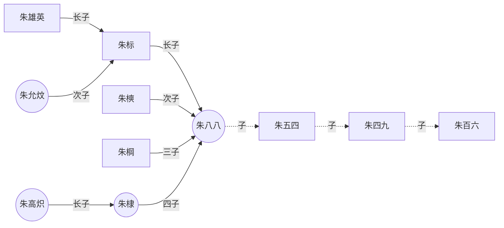

<!--
 * @Author: yingcai.huang
 * @Date: 2022-02-11 15:23:35
 * @LastEditTime: 2022-02-17 11:29:19
 * @LastEditors: yingcai.huang
 * @Description: 
 * @FilePath: /Gonote/Readme.md
 * 引用代码请说明出处
-->
功能特性

- [ ]  开箱即用

- [ ] 自动上报

- [ ] 自动切换

